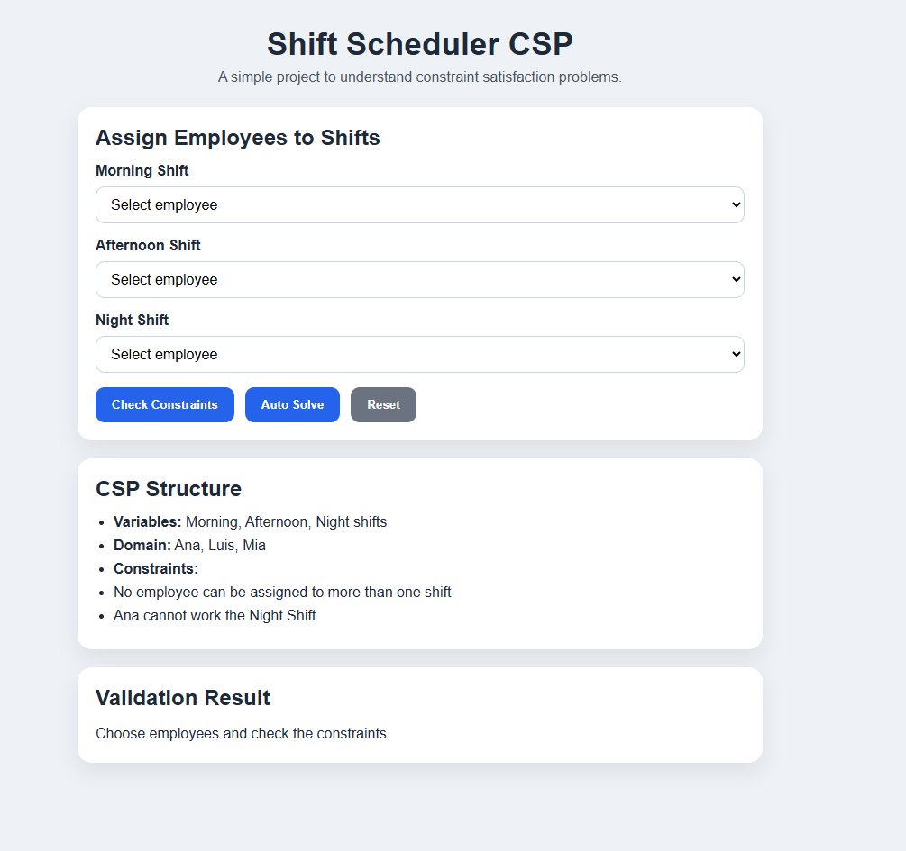
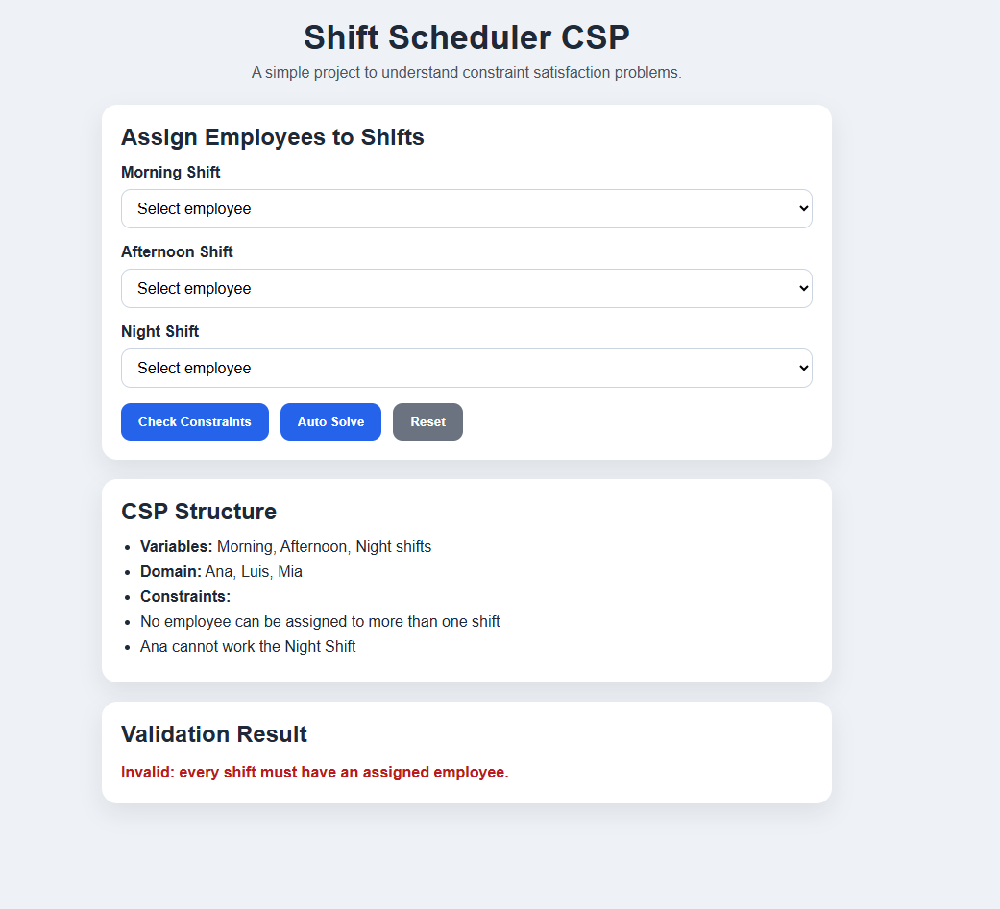
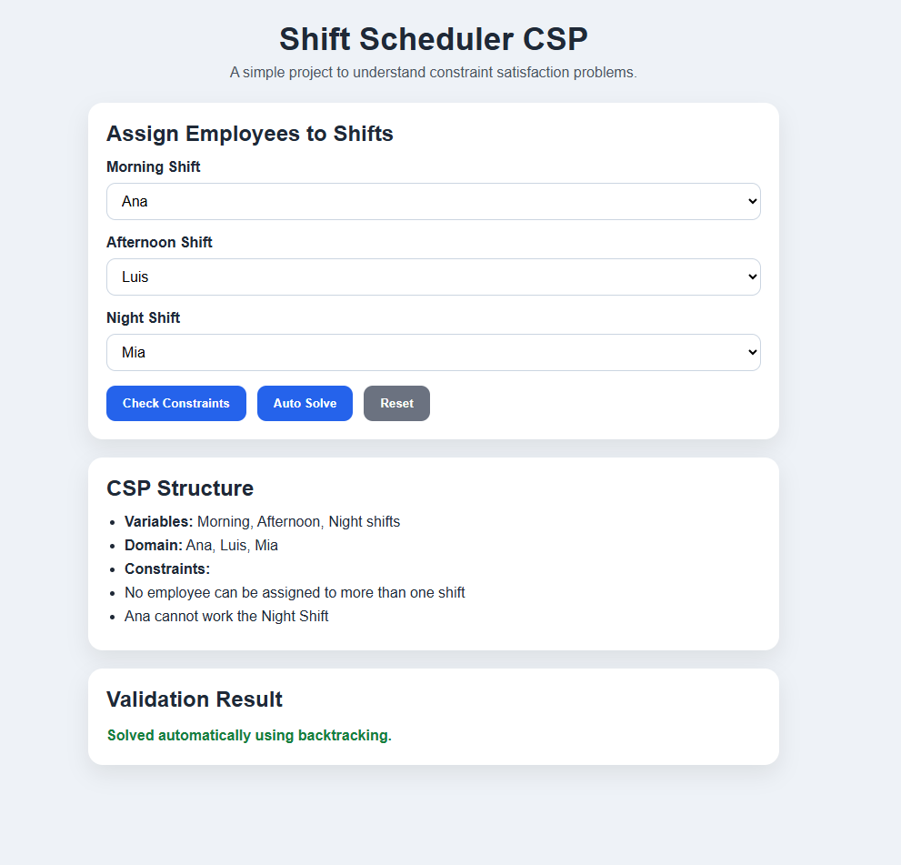

# 🧠 Shift Scheduler CSP – Backtracking Demo

A simple front-end project built with HTML, CSS, and JavaScript to demonstrate how Constraint Satisfaction Problems (CSPs) work in scheduling scenarios.

---

## 🚀 Live Demo

👉 [View the app](https://devcodemate.github.io/shift-scheduler-csp/)

---

## 💻 Repository

👉 [View source code][(https://devcodemate.github.io/shift-scheduler-csp/)

---

## 📸 App Preview

### Initial State

### Invalid Assignment

### Auto Solve with Backtracking

---

## 📌 Project Overview

This project models a small scheduling problem as a Constraint Satisfaction Problem (CSP).

In this app:
- shifts are the variables
- employees are the domain values
- scheduling rules are the constraints

The app allows the user to:
- manually assign employees to shifts
- validate the assignment
- automatically solve the schedule using backtracking

---

## 🧩 CSP Structure

- **Variables:** Morning, Afternoon, Night shifts
- **Domain:** Ana, Luis, Mia
- **Constraints:**
  - No employee can be assigned to more than one shift
  - Ana cannot work the Night Shift

---

## ⚙️ Features

- Interactive shift assignment
- Constraint validation
- Backtracking-based auto solver
- Valid / invalid feedback
- Clean UI

---

## 🛠️ Technologies

- HTML
- CSS
- JavaScript

---

## 🧪 Example Test Cases

### Valid Assignment
- Morning = Ana
- Afternoon = Luis
- Night = Mia

### Invalid Assignment (Repeated Employee)
- Morning = Ana
- Afternoon = Ana
- Night = Luis

### Invalid Assignment (Night Restriction)
- Morning = Luis
- Afternoon = Mia
- Night = Ana

### Auto Solve
- Leave all shifts empty
- Click **Auto Solve**

---

## 🧠 Concepts Applied

- Constraint Satisfaction Problems (CSPs)
- Variables, domains, constraints
- Backtracking
- Scheduling and resource allocation

---

## 💡 Key Learning

This project helped me understand how AI can model real-world scheduling problems through constraints, and how backtracking can search for a valid solution step by step.

---

## 🔮 Future Improvements

- Add more employees and shifts
- Add employee availability rules
- Visualize backtracking steps
- Add forward checking
- Support custom constraint rules

---

## 👩‍💻 Author

<CodeMate> — building projects to learn AI through hands-on development 🚀
